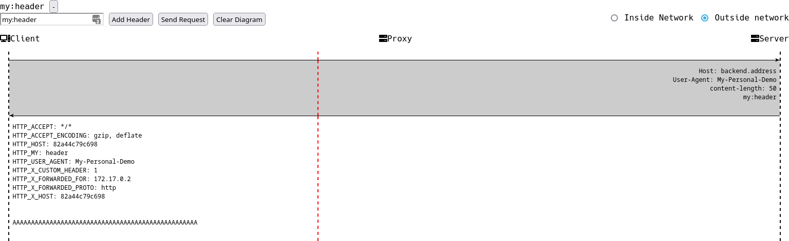
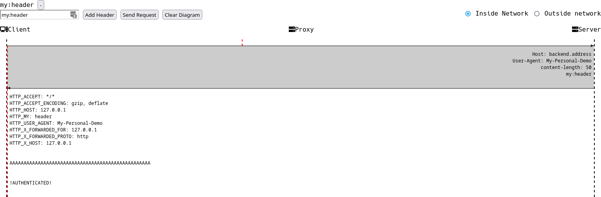
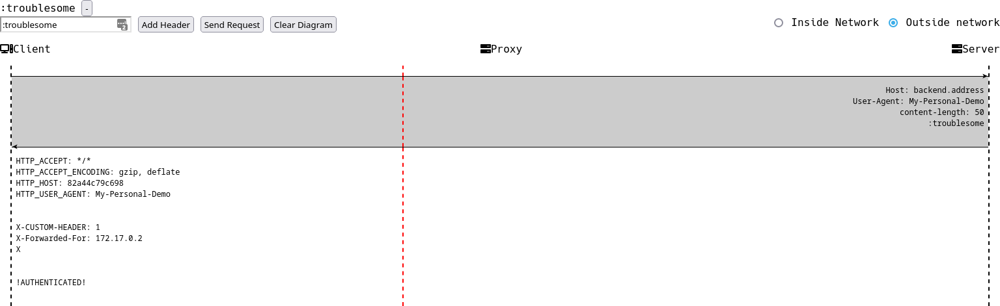

# An Auth Bypass Bug saved on a Technicality
In the course or our research we came across an Auth Bypass bug that exists because of the use of an outdated version of software. The bypass ultimately becomes ineffective on that product due to techinical limitations.

A brief description of the bug and the setup where this would be a vulnerability is described below. A more technical description and demo of the bug in play are further below.

## TL-DR
### Describe vunlerable setup of systems
The bug potentially becomes an Auth Bypass issue when an application is setup behind a reverse proxy that handles the authentication by adding "Authentication-Me" header when it is required. 

Say for example an application is deployed in a network and is connected to a reverse proxy to reduce repetitive or static request traffic. The proxy is accessible from within the network and from outside as well. A common business logic requirement dictates that requests made from within the network be handled differently from those made from outside, supposedly from the internet. Such systems oft solve this by implimenting a custom authentication header that is tacked on by the reverse proxy on those requests from outside the network. The backend server looks for the custom header if not found would handle the request without authentication. This way requests made from within a specified network would not be required to authenticate to be able to access resources and services.

*To demonstrate the bug we will the use layout described above with Lighttpd Proxy and a simple WSGI python server.*



## tracinng the payload down to sync
There are a lot of systems that use this configuration. But consider the request below.


The malformed header `:troublesome` is of intreset here. The process is going well until it hits the backend server. The Custom Header is in place but is somehow not processed by the backend server. This is so because there is a discrepancy in where the proxy is considering the end of headers as opposed to where the backend server assumes it is located. The malformed header causes the WSGI server to stop parsing header data thereby leaving the rest of the request data, which should have been parsed as headers into the body of the request. 

### Pinpointing where the divergent behavior happens
When we traced the request above we see that the backend WSGI server receives more request headers than it processes in its application code. So the exact divergent behavior occurs when the headers were preprocessed by WSGI server library code before it is handed to the business logic handling code/ `app`.

We will dive in to the "code" of it all and see exactly where the bug happens next. If you wish you can skip to [`Potential Exploitation of the bug`](#potential-Exploitation-of-the-bug)  section.

## A Deeper Dive
All the noteworty points of contact the payload makes with the application code are traced below.
### wsgi application using the headers
`/usr/lib/python2.7/BaseHTTPServer.py:213 parse_request`->
`/usr/lib/python2.7/mimetools.py:24 __init__`->
`/usr/lib/python2.7/rfc822.py:106 __init__`->
`/usr/lib/python2.7/rfc822.py:172 readheaders`->
```python
           headerseen = self.isheader(line)
            if headerseen: 
							...
            else:
                if not self.dict:
                    self.status = 'No headers'
                else:	# <----------- ping
                    self.status = 'Non-header line where header expected'
                if unread:
                    unread(line)
                elif tell:
                    self.fp.seek(startofline)
                else:	# <----------- ping
                    self.status = self.status + '; bad seek'
                break
```
`/usr/lib/python2.7/rfc822.py:200 isheader`
```python
        i = line.find(':') #<--------- find returns 0 on our malformed header
        if i > 0:	#<---------- expecting a -1 find not finding : in header this breaks parsing 
            return line[:i].lower()
        else:
            return	#<---------- we get None returned
```

Here is where our payload is processed by the backend server. The `readheaders` function loops through headers split with CRLF token and tries to parse it to header name and value paris. It tries to dicern wether the line is an actual header using the `isheader` function in rfc822 library. 
	
>The Internet RFC 822 specification defines an electronic message format consisting of header fields and an optional message body. The header fields contain information about the message, such as the sender, the recipient, and the subject.

When it splits the header to name and value pair using `:` as a separator, it uses python's find function to find the delimiter which returns -1 if it is not found. The  next line checks if the position found is greater that zero. The intent here is continue if the value is not -1 therefore header name and value can be splitted.

Our payload on the other hand has the `:` seperator on the first index 0 which trips up the code and make it think there is no separator. Hence returning false. Meanwhile on the calling function when `isheader` returns false the function cites bad seek and breaks out of the parsing loop. This is why header parsing stops on our payload and anything that comes after it is left in the input socket unprocessed later to be erroneously identified as request body.
	
proxy processing
	[TODO] look into Lighttpd Header parsing code 
		- stressing hte proxy should not have passed along such a bad header

## <a id="potential-Exploitation-of-the-bug">Potential Exploitation of the bug</a>

In the system described above the use of this header will cause a potential Authentication bypass. When the backend server checks for the presence of the custom Authentication header it does not appear to be present. So the server assumes this request originated from within the network and does not enforce authentication. 

The catch here is that the headers below the payload and any custom headers added by the proxy will be pending on the input socket as the body of the request. If the business logic expects a certain format in the body of the request this extra input will muck it up and might neutralize the bypass.
	
## demo bug light httpd + wsgi server

	
	
## Takeaways
- Be aware of the pitfalls of outdated versions or software. especially when they 
- Wonder why proxy allowed such a header to pass through.
	